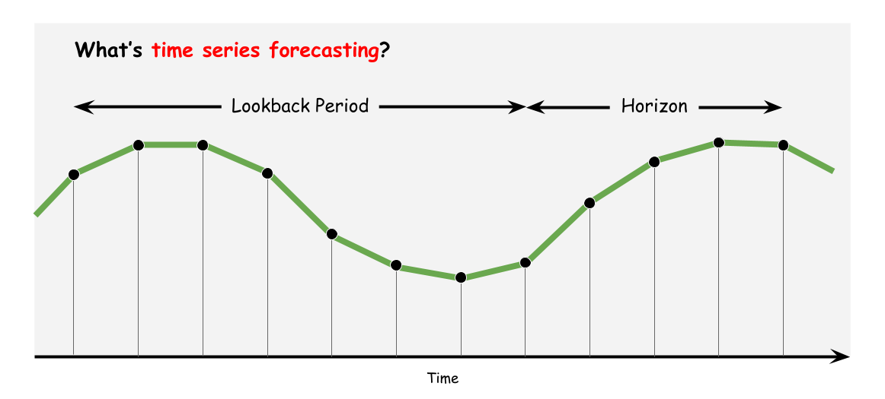

<div align="center">
  
</div>

[](https://pypi.org/project/tsts/0.3.0/)
[](https://github.com/TakuyaShintate/tsts/blob/main/LICENSE)

([Docs](https://takuyashintate.github.io/tsts/))([Benchmark](https://github.com/TakuyaShintate/tsts/tree/main/benchmark/))

## Introduction

tsts is an open-source easy-to-use toolset for time series forecasting.

## What's New

### Sep, 10

✨ New Model  

Informer and related modules were added. See [results](https://github.com/TakuyaShintate/tsts/tree/main/benchmark/informer) for how to use it.

## Installation

```
pip install tsts
```

## Task Details

<div align="center">
  
</div>

Time series forecasting is the task to predict the values of the time series on **Horizon** given the values of the time series on **Lookback Period**. Note that data can be multivariate.

## Available Modules

Following modules are supported.

<table align="center">
  <tbody>
    <tr align="center" valign="bottom">
      <td>
        <b>Architectures</b>
      </td>
      <td>
        <b>Losses</b>
      </td>
      <td>
        <b>Metrics</b>
      </td>
      <td>
        <b>Optimizers</b>
      </td>
      <td>
        <b>Scalers</b>
      </td>
      <td>
        <b>Schedulers</b>
      </td>
    </tr>
    <tr>
      <td>
        <li>Informer</li>
        <li>NBeats</li>
        <li>Seq2Seq</li>
      </td>
      <td>
        <li>DILATE</li>
        <li>MAPE</li>
        <li>MSE</li>
      </td>
      <td>
        <li>MAE</li>
        <li>MSE</li>
        <li>RMSE</li>
        <li>MAPE</li>
      </td>
      <td>
        <li>Adam</li>
        <li>SGD</li>
      </td>
      <td>
        <li>MinMaxScaler</li>
        <li>StandardScaler</li>
      </td>
      <td>
        <li>CosineAnnealing</li>
        <li>StepScheduler</li>
      </td>
    </td>
    </tr>
  </tbody>
</table>

## Getting Started

Following example shows how to train a model on sine curve dataset. See [Docs](https://takuyashintate.github.io/tsts/) for the details.

### Training

Without a log directory path provided by config, it automatically generates a random log directory.

```python
import torch
from tsts.solvers import TimeSeriesForecaster

sin_dataset = torch.sin(torch.arange(0, 100, 0.1))
sin_dataset = sin_dataset.unsqueeze(-1)
forecaster = TimeSeriesForecaster()
forecaster.fit([sin_dataset])
``` 

### Inference

For inference, it needs to load parameters from a log directory generated in training.

```yaml
# inference.yml
LOGGER:
  LOG_DIR: "log directory generated in training"
```

```python
import torch
from tsts.solvers import TimeSeriesForecaster

X = torch.sin(torch.arange(0.0, 10.0, 0.1)).unsqueeze(1)
forecaster = TimeSeriesForecaster("inference.yml")
forecaster.predict(X)
```

## Examples

See [Benchmark](https://github.com/TakuyaShintate/tsts/tree/main/benchmark/) for advanced usage.
