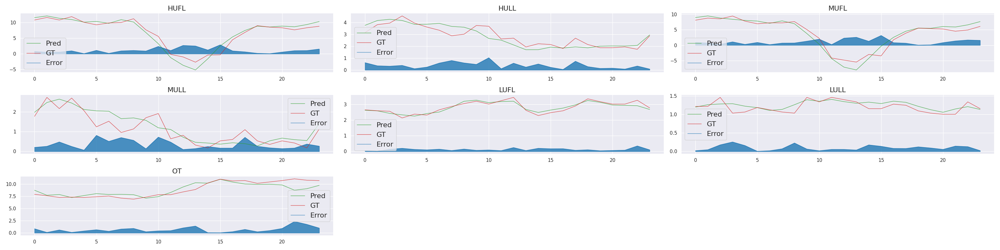

<div align="center">
  
</div>

---

[](https://pypi.org/project/tsts/1.0.0/)
[](https://github.com/TakuyaShintate/tsts/blob/main/LICENSE)

<div align="center">
  
</div>

English/[日本語](README_JP.md)

([documentations](https://takuyashintate.github.io/tsts/))

## ❓ About this project

`tsts` is an open source project that provides state-of-the-art time series forecasting methods.

It allows for more flexible model building, such as building models in combination with autoregressive (AR) models and deep learning models. In addition to models, `tsts` also provides the latest modules for data augmentation, loss functions, and optimizers, etc.

## ⛏ Installation

```
pip install tsts
```

Or install the development version by

```
pip install git+https://github.com/takuyashintate/tsts
```

## ⚡️Config Samples

See [samples](cfg) for examples of how each model is used.

## 🚀 Getting Started

If you want to measure the performance of your model on a given benchmark, see "Using `tools/train.py` & `tools/test.py`" or "Using the API" if you want to make predictions online.

### Using `tools/train.py` & `tools/test.py`

✅ Less code is required for learning & inference

#### 1. Preparation of data to be used for training

Save the training data (CSV files), validation data, and test data in their respective directories. The name of the directory is arbitrary. If there are multiple training, validation, and test data, please save them all in their respective directories.

#### 2. Create a config file

Create a config file describing the settings during training. You can specify the model, Data Augmentation, Optimizer, Learning Rate Scheduler, etc. See [documentations](https://takuyashintate.github.io/tsts/projects/config.html) for details on the possible configuration items.

For simplicity, we will use a minimal config file here. Save the following as `my_first_model.yml`. You can use a different model or methodology by copying the target section from [documentations](https://takuyashintate.github.io/tsts/).

```yaml
# Save as `my_first_model.yml`
LOGGER:
  LOG_DIR: "my-first-model"
```

#### 3. Training

Execute the command below to begin training. Once training begins, model parameters and a log file will be created in the directory specified in 2 (`my-first-model` here). The log file will contain loss and metric values for each epoch.

> Loss functions and metrics can be changed as well as models

Specify the directory where the training and validation data are stored in `--train-dir` and `--valid-dir`. Specify a list of input variable names and a list of output variable names in `--in-feats` and `--out-feats`.

Sometimes you may want to predict the value of an output variable at the same time as the input variable (i.e., you want to predict the value of an output variable at time t-n to t for the value of an input variable at time t-n to t). In such cases, add the `--lagging` option.

```
python tools/train.py \
    --cfg-name my_first_model.yml \
    --train-dir <dir to contain training data> \
    --valid-dir <dir to contain validation data> \
    --in-feats <list of input feature names> \
    --out-feats <list of output feature names>
```

#### 4. Testing a trained model

After training is complete, the command below can be executed to obtain the prediction results for the test data. CSV files containing the prediction results, the correct labels, and their errors will be saved in the directory specified by `--out-dir`, and images of them plotted. Results are saved for each test data.

```
python tools/test.py \
    --cfg-name my_first_model.yml \
    --train-dir <dir to contain training data> \
    --valid-dir <dir to contain validation data> \
    --test-dir <dir to contain test data> \
    --in-feats <list of input feature names> \
    --out-feats <list of output feature names> \
    --out-dir <result is saved in this directory>
```

### Using API

✅ Can be used to predict future values

#### 1~3. Data Preparation ~ Learning

Same procedure as when using `tools/train.py` & `tools/test.py`.

#### 4. Testing a trained model

Forecasts are made with arbitrary values with a trained model.

> Size of input values must be of (number of time steps, number of variables)

```python
from tsts.apis import init_forecaster, run_forecaster
from tsts.utils import plot


(solver, X_scaler, y_scaler) = init_forecaster(
    cfg_name,  # config file (like "my_first_model.yml")
    train_dir,  # dir to contain training data
    in_feats,  # list of input feature names
    out_feats,  # list of output feature names
)
Z = run_forecaster(
    solver,
    X_scaler,
    y_scaler,
    X,  # torch.Tensor of (number of time steps, number of variables)
)
plot(Z)
```
