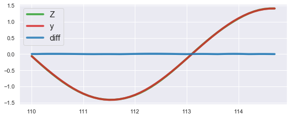

<div align="center">
  
</div>

[](https://pypi.org/project/tsts/0.8.3/)
[](https://github.com/TakuyaShintate/tsts/blob/main/LICENSE)

([Docs](https://takuyashintate.github.io/tsts/))([Benchmark](https://github.com/TakuyaShintate/tsts/tree/main/benchmark/))

## Introduction

tsts is an open-source easy-to-use toolset for time series forecasting.

## What's New

### Jan, 20, 2022

✨ New Tool

Utility tool was added to launch training easily.

#### Example

(training)

```bash
python tools/train.py \
    --cfg-name config \ # config path
    --train-dir train-dir \ # directory which contains train data (csv files)
    --valid-dir valid-dir \ # directory which contains validation data (csv files)
    --in-feats a b \ # list of input features
    --out-feats c d \ # list of output features
```

### Sep, 23, 2021

🍎 Updated Results

[Results](https://github.com/TakuyaShintate/tsts/tree/main/benchmark/) on ETTh1 (horizon=48) are updated across different models in comparable way.

### Sep, 21, 2021

✨ New Model

SCINet was added. I am working on stacked version of it now.

### Sep, 10, 2021

✨ New Model  

Informer and related modules were added. See [results](https://github.com/TakuyaShintate/tsts/tree/main/benchmark/informer) for how to use it.

## Installation

```
pip install tsts
```

## Task Details

<div align="center">
  
</div>

Time series forecasting is the task to predict the values of the time series on **Horizon** given the values of the time series on **Lookback Period**. Note that data can be multivariate.

## Available Modules

Following modules are supported.

<table align="center">
  <tbody>
    <tr align="center" valign="bottom">
      <td>
        <b>Architectures</b>
      </td>
      <td>
        <b>Losses</b>
      </td>
      <td>
        <b>Metrics</b>
      </td>
      <td>
        <b>Optimizers</b>
      </td>
      <td>
        <b>Scalers</b>
      </td>
      <td>
        <b>Schedulers</b>
      </td>
    </tr>
    <tr>
      <td>
        <li>AR</li>
        <li>HistricalInertia</li>
        <li>Informer</li>
        <li>NBeats</li>
        <li>SCINet</li>
        <li>Seq2Seq</li>
      </td>
      <td>
        <li>DILATE</li>
        <li>MAE</li>
        <li>MAPE</li>
        <li>MSE</li>
        <li>SmoothMAE</li>
      </td>
      <td>
        <li>MAE</li>
        <li>MSE</li>
        <li>RMSE</li>
        <li>MAPE</li>
      </td>
      <td>
        <li>Adam</li>
        <li>AdamW</li>
        <li>SAM</li>
        <li>SGD</li>
      </td>
      <td>
        <li>MinMaxScaler</li>
        <li>StandardScaler</li>
      </td>
      <td>
        <li>CosineAnnealing</li>
        <li>CosineAnnealingWithRestarts</li>
        <li>ExponentialDecay</li>
        <li>StepScheduler</li>
      </td>
    </td>
    </tr>
  </tbody>
</table>

## Getting Started

Following example shows how to train a model on sine curve dataset. See [Docs](https://takuyashintate.github.io/tsts/) for the details.

### Training

Define config and start training with it.

```yaml
# cfg.yml
LOGGER:
  # Log file and parameters are saved here
  LOG_DIR: "my-first-tsts-model"
```

```python
import torch
from tsts.solvers import TimeSeriesForecaster

# Define training + validation datasets (they are divided inside)
sin_dataset = torch.sin(torch.arange(0.0, 100.0, 0.1))
sin_dataset = sin_dataset.unsqueeze(-1)

# Run training
forecaster = TimeSeriesForecaster("cfg.yml")
forecaster.fit([sin_dataset])
``` 

See results in `my-first-tsts-model` directory.

### Inference

For inference, it needs to load parameters from a log directory generated in training.

```python
import torch
from tsts.scalers import StandardScaler
from tsts.solvers import TimeSeriesForecaster
from tsts.utils import plot

# Initialize scaler with training dataset
sin_dataset = torch.sin(torch.arange(0.0, 100.0, 0.1))
sin_dataset = sin_dataset.unsqueeze(-1)
# NOTE: 0.75 is default training validation dataset ratio (training: 0.75, validation: 0.25)
num_train_samples = int(0.75 * len(sin_dataset))
sin_dataset = sin_dataset[:num_train_samples]

X_scaler = StandardScaler()
X_scaler.fit(sin_dataset)

# Define test dataset
X = torch.sin(torch.arange(100.0, 110.0, 0.1))
X = X.unsqueeze(-1)
X = X_scaler.transform(X)

# Run inference
forecaster = TimeSeriesForecaster("cfg.yml")
Z = forecaster.predict(X)

# Initialize target to compare prediction with it
y = torch.sin(torch.arange(110.0, 114.8, 0.1)).unsqueeze(1)
y = X_scaler.transform(y)

# Result
plot(Z, y, xticks=torch.arange(110.0, 114.8, 0.1))
```

Result:

<div align="center">
  
</div>

## Examples

See [Benchmark](https://github.com/TakuyaShintate/tsts/tree/main/benchmark/) for advanced usage.
