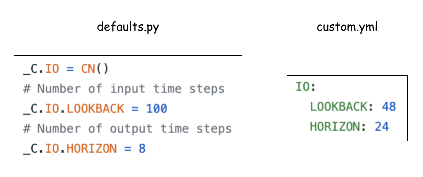

======
Config
======

In this tutorial, how to set config to change default values/modules.

Overview
========

**TimeSeriesForecasting** is the main interface for training and inference. It takes the path to a config file and merges the values with a default internally. If no config file path is given, **TimeSeriesForecasting** uses a default. Default values are defined in **tsts/cfg/defaults.py**.

Config File
===========

Config file is represented as YAML file. Below figure shows the correspondence between default values and custom values. See how to overwrite **IO.LOOKBACK** and **IO.HORIZON**.

To overwrite a default with the config file, just pass the path to the config file to **TimeSeriesForecasting**. It reads the content and merges it with a default. In this case, the lengths of input/output time series are updated to 48/24 respectively.

.. code-block:: python

    from tsts.solvers import TimeSeriesForecasting

    solver = TimeSeriesForecasting("custom.yml")
