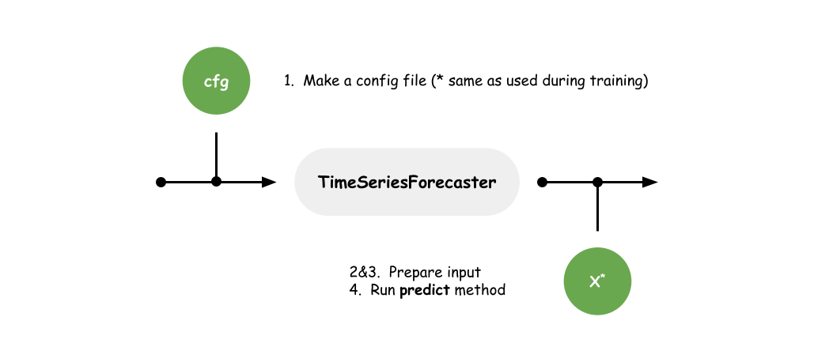

====================
(Tutorial) Inference
====================

In this tutorial, we will learn how to run inference on a test data.

Workflow
========

For inference, we have 2 steps:

1. Load pre-trained model
2. Prepare input
3. Run **predict** method

(Step 1) Loading pre-trained model
==================================

To load pre-trained model, just pass the config file which was used for training.

.. code-block:: python

    from tsts.solvers import TimeSeriesForecaster

    # "cfg.yml" is a config file made in **(Tutorial 1) Training**.
    forecaster = TimeSeriesForecaster("cfg.yml")

It will load saved parameters by referring to the directory indicated by **LOG_DIR**.

.. note:: if your config file does not have **LOG_DIR**, add it with random generated directory name (if your config file does not have **LOG_DIR**, **fit** method generates random named directory).

(Step 2) Initializing scaler
============================

To preprocess input as in the same way to training dataset, initialize scaler with training dataset.

.. code-block:: python

    import torch
    from tsts.scalers import StandardScaler

    # Restore training dataset
    sin_dataset = torch.sin(torch.arange(0.0, 100.0, 0.1))
    sin_dataset = sin_dataset.unsqueeze(-1)
    # NOTE: We used 0.8 for TRAINING.TRAIN_DATA_RATIO 
    num_train_samples = int(0.8 * len(sin_dataset))
    sin_dataset = sin_dataset[:num_train_samples]

    # Run **fit** method to initialize scaler
    X_scaler = StandardScaler()
    X_scaler.fit(sin_dataset)

(Step 3) Input Data Preparation
===============================

Preprocess input data with the scaler initialized in previous step.

.. code-block:: python

    # Use next 100 steps as input
    X = torch.sin(torch.arange(100.0, 110.0, 0.1))
    X = X.unsqueeze(-1)

    # Use scaler initialized in previous step
    X = X_scaler.transform(X)

(Step 4) Running **predict** Method
===================================

Run **predict** method with the preprocessed input. Unlike **fit** method which takes as input a list of datasets, **predict** method takes as input a tensor which size is (num steps, num feats).

.. note:: the preprocessed input could be shorter or longer than the value of **IO.LOOKBACK**. It paddings or removes the input automatically.

.. code-block:: python

    Z = forecaster.predict(X)

Full script is `here <https://github.com/TakuyaShintate/tsts/tree/main/examples/tutorial_2_inference.ipynb>`_.
