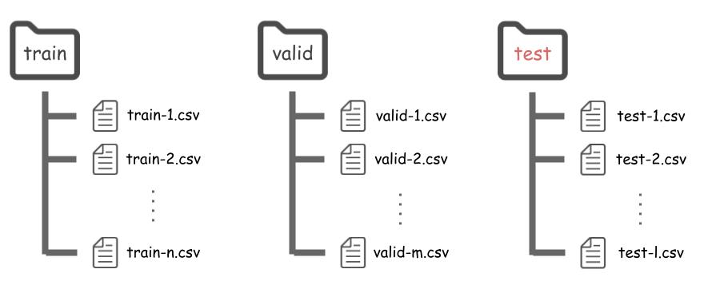

========================
Test on a Custom Dataset
========================

**tools/test.py** can be used to test forecasting models on a custom dataset.

--------------------------
1. Create a Custom Dataset
--------------------------

Put .csv files to test directory (in the same way to train).

.. note:: Any directory names can be used

🗂 Directory Structure
----------------------

-------------------------
2. Test Forecasting Model
-------------------------

Run **tools/test.py** with the custom dataset and config. Input/output feature names have to be specified too.

.. code-block:: bash

   python tools/test.py \
    --cfg-name config.yml \
    --train-dir train \
    --valid-dir valid \
    --test-dir test \
    --in-feats input_feat1 input_feat2 \
    --out-feats output_feat1 output_feat2 \
    --out-dir log \
